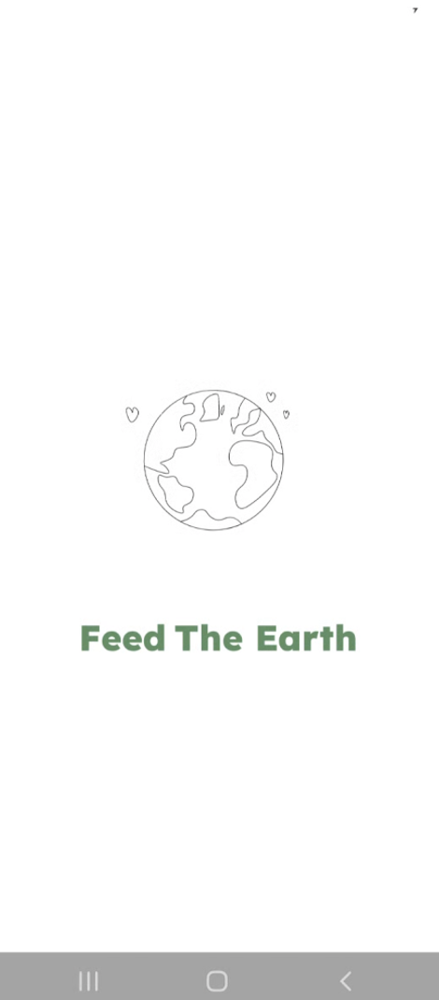
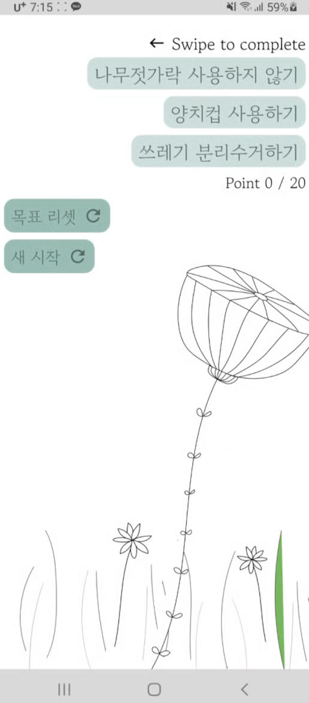
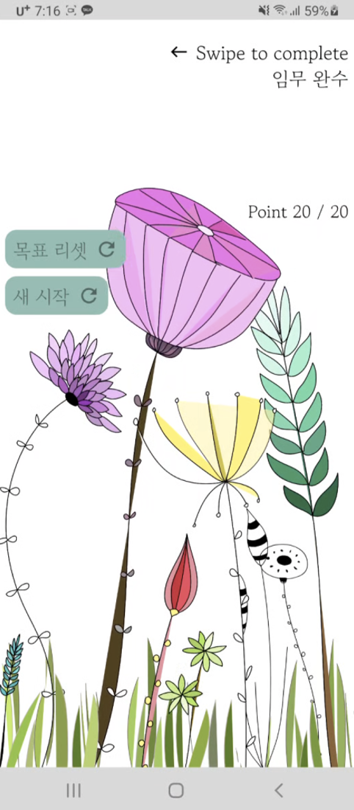

# GDSC WINTER HACK
### 10조 레코동(recodon)팀 - < FEED THE EARTH >   
## 팀원
- 오승언
- 신유빈

## apk file release
https://github.com/gdsckoreahackathon2022/10_feedTheEarth/releases/tag/apk

## 선정주제
#### 3번 - Climate Action
### 주제선정이유
1. 인류가 함께 발 벗고 나서서 해결해야할 문제
2. 코로나 이후로 배달음식 소비 등의 증가로 일회용품 사용 급증
3. 일상생활 속 환경보호는 이제 선택이 아닌 의무
4. 친환경적인 습관을 들일 수 있게 하는 앱의 필요성을 느낌

## 사용 기술
- Android Jetpack Compose
- Lottie Library
- Room database

## 앱 구동 화면
### 스플래시 화면
   

### 초기화면 및 기능

1. 오른쪽 상단에 목표들이 3개씩 띄워짐
2. 목표 리셋 버튼 & 새시작 버튼
3. 목표를 완료하였을 경우 개당 포인트 1점, 총 포인트 20점 획득시 미션완료
4. 3포인트를 획득할 때마다 꽃의 갯수가 늘어나며 꽃잎에 색이 칠해지게 됨

   
### 최종 화면
   

## 확장 방향성
1. 목표 스와이프 시 소리 기능 추가
2. 자동 초기화 기능 추가
